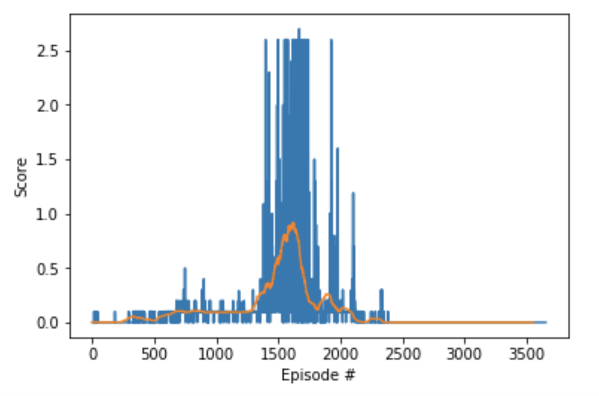

# Deep Reinforcement Learning: Collaboration and Competition

[tennis]: misc/tennis.gif "Unity ML-Agents Tennis Environment."

## License

By using this site, you agree to the **Terms of Use** that are defined in [LICENSE](https://github.com/youldash/DRL-Collaboration-and-Competition/blob/master/LICENSE).

## About

The goal of this project is to train a so-called [intelligent agent](https://en.wikipedia.org/wiki/Intelligent_agent) (in the form of a tennis racket) to bounce a ball over a net in a virtual world (or environment).

	

This project was developed in partial fulfillment of the requirements for Udacity's [Deep Reinforcement Learning Nanodegree](https://www.udacity.com/course/deep-reinforcement-learning-nanodegree--nd893) program.

## Reinforcement Learning

According to **skymind.ai**, the term [Reinforcement Learning (RL)](https://skymind.ai/wiki/deep-reinforcement-learning) refers to:

> Goal-oriented algorithms, which learn how to attain a complex objective (goal) or how to maximize along a particular dimension over many steps; for example, they can maximize the points won in a game over many moves. RL algorithms can start from a blank slate, and under the right conditions, they achieve superhuman performance. Like a pet incentivized by scolding and treats, these algorithms are penalized when they make the wrong decisions and rewarded when they make the right ones – this is reinforcement.

### Deep Reinforcement Learning

[Deep Reinforcement Learning (DRL)](https://skymind.ai/wiki/deep-reinforcement-learning) combines [Artificial Neural Networks (ANNs)](https://en.wikipedia.org/wiki/Artificial_neural_network) with an RL architecture that enables software-defined agents to learn the best actions possible in virtual environment in order to attain their goals. That is, it unites function approximation and target optimization, mapping state-action pairs to expected rewards.

## Project Environment

The project development environment is based on [Unity](https://unity.com)'s [Machine Learning Agents Toolkit (ML-Agents)](https://github.com/Unity-Technologies/ml-agents). The [toolkit](https://unity3d.ai/) is an open-source Unity plugin that enables games and simulations to serve as environments for training intelligent agents.

The project environment is referred to the [Tennis](https://github.com/Unity-Technologies/ml-agents/blob/master/docs/Learning-Environment-Examples.md#tennis) environment, which can be found on the Unity ML-Agents GitHub page.

### The Tennis Racket

In this environment, two agents control rackets to bounce a ball over a net. If an agent hits the ball over the net, it receives a reward of `+0.1`. If an agent lets a ball hit the ground or hits the ball out of bounds, it receives a reward of `-0.01`. Thus, the goal of each agent is to keep the ball in play.

### The State Space

The observation (or state) space consists of `8` variables corresponding to the position and velocity of the ball and racket. Each agent receives its own, local observation. 

### The Action Space

Two continuous actions are available, corresponding to movement toward (or away from) the net, and jumping.

## Solving the Environment

The task is episodic, and in order to solve the environment, your agents must get an average score of `+0.5` (over **100** consecutive episodes, after taking the maximum over both agents). Specifically,

* After each episode, we add up the rewards that each agent received (without discounting), to get a score for each agent. This yields **2** (potentially different) scores. We then take the maximum of these **2** scores.
* This yields a single **score** for each episode.

Note that due to the multi-agent nature of this problem, you are likely to experience a bit of instability during training. 

__Example:__ Consider the plot below. In this plot the blue line shows the **maximum score** over both agents, for each episode, and the orange line shows the **average score** (after taking the maximum over both agents) over the next **100** episodes.

[average score]: misc/plot.png "Scores plot from the solution code."

	

The environment is considered **solved**, when the average (over **100** episodes) of those scores is at least `+0.5`.

### Step 1: Clone the DRLND Repository

At first, you need to follow the [instructions in the DRLND GitHub repository](https://github.com/udacity/deep-reinforcement-learning#dependencies) to set up your [Python](https://www.python.org) environment. These instructions can be found in `README.md` at the root of the repository. By following these instructions, you will install [PyTorch](https://pytorch.org), the ML-Agents toolkit, and a few more Python packages required to complete the project.

__For Windows users:__ The ML-Agents toolkit supports **Windows 10**. While it might be possible to run the ML-Agents toolkit using other versions of Windows, it has not been tested on other versions. Furthermore, the ML-Agents toolkit has not been tested on a Windows VM such as Bootcamp or Parallels.

> __SPECIAL NOTE TO BETA TESTERS__ Please also download the `p3_collab-compet` folder from [here](https://s3-us-west-1.amazonaws.com/udacity-drlnd/tmp/p3_collab-compet.zip) and place it in the DRLND GitHub repository.

### Step 2: Download the Unity Environment

For this project, you will **not** need to install Unity - this is because Udacity already built the environment for you, and you can download it from one of the links below. You need only select the environment that matches your operating system:

- __Linux__ [click here](https://s3-us-west-1.amazonaws.com/udacity-drlnd/P3/Tennis/Tennis_Linux.zip).
- __macOS__ [click here](https://s3-us-west-1.amazonaws.com/udacity-drlnd/P3/Tennis/Tennis.app.zip).
- __Windows (32-bit)__ [click here](https://s3-us-west-1.amazonaws.com/udacity-drlnd/P3/Tennis/Tennis_Windows_x86.zip).
- __Windows (64-bit)__ [click here](https://s3-us-west-1.amazonaws.com/udacity-drlnd/P3/Tennis/Tennis_Windows_x86_64.zip).

Then, place the file in the `p3_collab-compet/` folder in the DRLND GitHub repository (provided that you have already completed Step 1), and unzip (or decompress) the file.

##### For Windows Users

Check out [this link](https://support.microsoft.com/en-us/help/827218/how-to-determine-whether-a-computer-is-running-a-32-bit-version-or-64) if you need help with determining if your computer is running a 32-bit version or 64-bit version of the Windows operating system.

##### For AWS Users

If you'd like to train the agent on AWS (and have not [enabled a virtual screen](https://github.com/Unity-Technologies/ml-agents/blob/master/docs/Training-on-Amazon-Web-Service.md)), then please use [this link](https://s3-us-west-1.amazonaws.com/udacity-drlnd/P2/Reacher/one_agent/Reacher_Linux_NoVis.zip) to obtain the "headless" version of the environment. You will **not** be able to watch the agent without enabling a virtual screen, but you will be able to train the agent.

> To watch the agent, you should follow the instructions to [enable a virtual screen](https://github.com/Unity-Technologies/ml-agents/blob/master/docs/Training-on-Amazon-Web-Service.md), and then download the environment for the **Linux** operating system above.

### Step 3: Explore the Environment

After you have followed the instructions above, open `Tennis.ipynb` (located in the `p3_collab-compet/` folder in the DRLND GitHub repository) and follow the instructions to learn how to use the Python API to control the agent.

In the last code cell of the notebook, you'll learn how to design and observe an agent that always selects random actions at each time step. The goal of this project is to create an agent that performs much better!

## Results

See [`REPORT.md`](https://github.com/youldash/DRL-Collaboration-and-Competition/blob/master/REPORT.md) for a detailed attempts made to solve the challenges presented. Feel free to use the code and notebooks in this repo for learning purposes, and perhaps to beat the attempts mentioned in the report.
