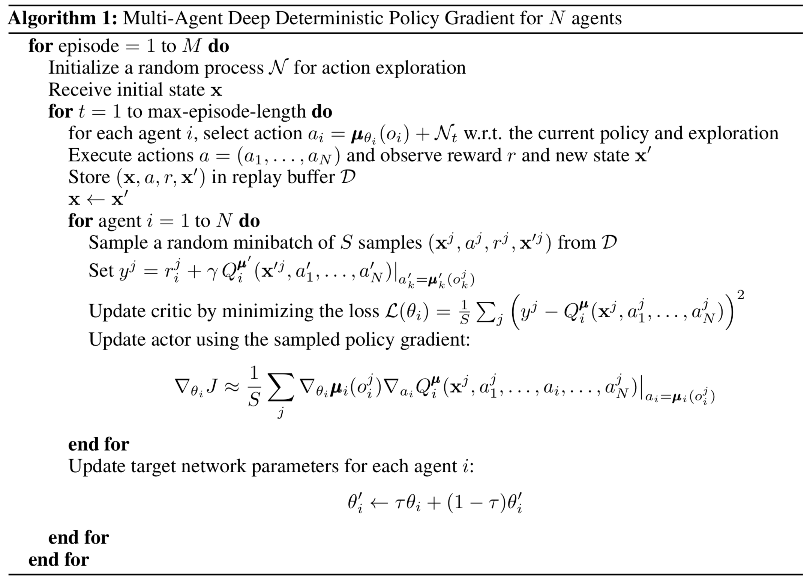
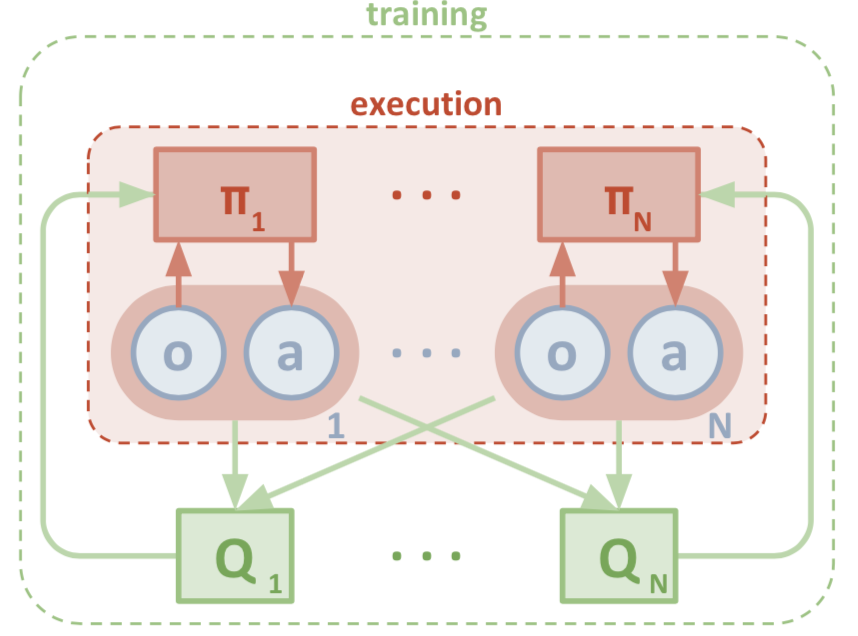
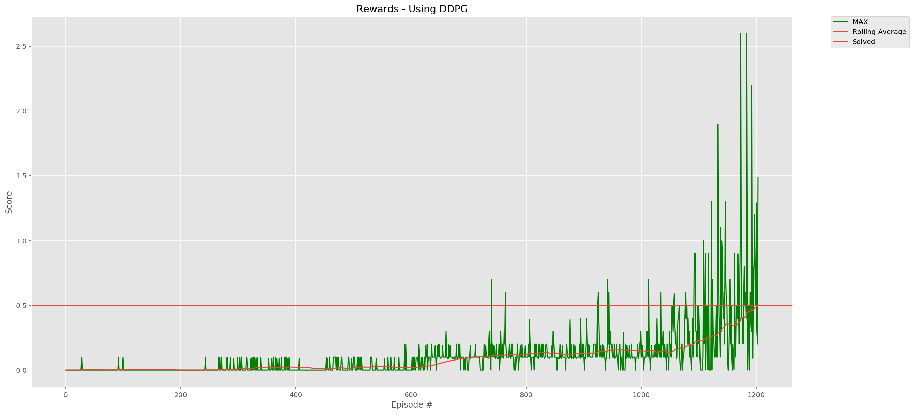

# Deep Reinforcement Learning: Collaboration and Competition (Report)

[](https://twitter.com/youldash)

## License

By using this site, you agree to the **Terms of Use** that are defined in [LICENSE](https://github.com/youldash/DRL-Collaboration-and-Competition/blob/master/LICENSE).

## Algorithm Implementation

As mentioned in the [`README.md`](https://github.com/youldash/DRL-Collaboration-and-Competition/blob/master/README.md) file of this repo, The project was developed in partial fulfillment of the requirements for Udacity's [Deep Reinforcement Learning (DRL) Nanodegree](https://www.udacity.com/course/deep-reinforcement-learning-nanodegree--nd893) program. To solve the challenges presented therein, we explored (and implemented) working versions of both

- the [Deep Deterministic Policy Gradient (DDPG)](https://spinningup.openai.com/en/latest/algorithms/ddpg.html) algorithm, and
- the [Multi-agent Deep Deterministic Policy Gradient (MADDPG)](https://openai.com/blog/learning-to-cooperate-compete-and-communicate/) algorithm (see [this paper](https://arxiv.org/pdf/1706.02275.pdf) for details).

The MADDPG is a great choice for this environment due to the existence of multiple agents, and the approach presented herein was inspired by the implementation used in the Udacity online labs for solving the physical deception environment.

In addition to the main MADDPG implementation and training runs, which are detailed in the accompanying [`TennisUsingMADDPG.ipynb`](https://github.com/youldash/DRL-Collaboration-and-Competition/blob/master/TennisUsingMADDPG.ipynb) notebook file, a detailed notebook for the DDPG test runs is also included (see [`TennisUsingDDPG.ipynb`](https://github.com/youldash/DRL-Collaboration-and-Competition/blob/master/TennisUsingDDPG.ipynb) for details). The reason for considering the DDPG algorithm in the first place (which was used to solve the challenges presented in the [previous Udacity project](https://github.com/youldash/DRL-Continuous-Control)) is due to its capability in solving this challenge too.

## The Multi-agent Deep Deterministic Policy Gradient (Learning) Algorithm

Initial attempts were made for developing `agent` implementations of the MADDPG algorithm (see `maddpg/agent.py` in this repo for details). The algorithm is summarized below:

[ddpg]: misc/algorithm.png "Multi-agent Deep Deterministic Policy Gradient (MADDPG)."

<div align="center">
	
</div>

The MADDPG agent employs the following two critical components to operate:

1. An **Actor** network (see `maddpg/model.py` for details).
2. A **Critic** network (see `maddpg/model.py` for details).

Initially, the MAPPDG algorithm was introduced as an extension of the DDPG algorithm for multi-agent environments. Think of MADDPG as a sort of "wrapper" for handling multiple DDPG agents. The power of the MADDPG algorithm on the other hand, resides in its adoption of a so-called "framework" for centralized training and decentralized execution. This means that there is (generally) extra information used during training that is not used during testing. More importantly, the training process makes use of both `actors` and `critics` (just like DDPG). The key-distinction here is that the input to each agent's critic consists of all the observations and actions (for all the agents combined). However, since only the `actor` is present during testing, that extra information used during training effectively, simply, fades away. As such, this framework makes the MADDPG algorithm **flexible enough** to handle competitive, collaborative, and mixed environments. Thus, it was mainly nominated for investigation in this project.

The following diagram illustrates how the MADDPG algorithm operates:

[ddpg]: misc/maddpg-process.png "MADDPG process."

<div align="center">
	
</div>

### The Actor

An **Actor**, based on the above MADDPG pseudocode listing, uses two [Artificial Neural Networks (ANNs)](https://en.wikipedia.org/wiki/Artificial_neural_network) for deterministic policy approximations as `state_i -> argmax_Q_i` mappings for each agent separately (each identified by an *identifier*, `i`).

### The Critic

Like an **Actor**, a **Critic** also uses an ANN with two "heads" for `Q-value` function approximation as `state1`, `state2`, `action1`, `action2 -> q_value1`, `q_value2`, where `state1`, `state2`, `action1`, `action2` are the states and actions of agents `#1` and `#2` correspondingly.

### Added Noise

Similar to the DDPG algorithm implementation in the previous project, the MADDPG algorithm implementation also incorporates a sample of the [Ornstein–Uhlenbeck stochastic process](https://en.wikipedia.org/wiki/Ornstein–Uhlenbeck_process). See `noise.py` implementation details, and on the previous link for a detailed mathematical description on the process.

## The DDPG (Network) Architecture

The [Neural Network (NN)](https://pathmind.com/wiki/neural-network) architecture (used in [`TennisUsingDDPG.ipynb`](https://github.com/youldash/DRL-Collaboration-and-Competition/blob/master/TennisUsingDDPG.ipynb)) for building the training model for the DDPG algorithm is logged below:

```
Actor (Local):
Actor(
  (fc1): Linear(in_features=24, out_features=768, bias=True)
  (fc2): Linear(in_features=768, out_features=512, bias=True)
  (fc3): Linear(in_features=512, out_features=2, bias=True)
)
Actor (Target):
Actor(
  (fc1): Linear(in_features=24, out_features=768, bias=True)
  (fc2): Linear(in_features=768, out_features=512, bias=True)
  (fc3): Linear(in_features=512, out_features=2, bias=True)
)
Critic (Local):
Critic(
  (fcs1): Linear(in_features=24, out_features=512, bias=True)
  (fc2): Linear(in_features=514, out_features=256, bias=True)
  (fc3): Linear(in_features=256, out_features=128, bias=True)
  (fc4): Linear(in_features=128, out_features=1, bias=True)
)
Critic (Target):
Critic(
  (fcs1): Linear(in_features=24, out_features=512, bias=True)
  (fc2): Linear(in_features=514, out_features=256, bias=True)
  (fc3): Linear(in_features=256, out_features=128, bias=True)
  (fc4): Linear(in_features=128, out_features=1, bias=True)
)
```

Each of the two agents in the DDPG implementation notebook (and accompanying source code) used the above architecture for solving the environment. See the `ddpg/` folder for implementation details.

### The Actor Model (Architecture)

As mentioned above, an `actor` builds an Actor (Policy) NN that maps `states -> actions`. Further, it (*i.e.* the `model`) is comprised of the following:

- The `actor` has `3` **Fully-connected (FC)** layers.
- The **first FC** layer takes in the **state**, and passes it through `786` nodes with `ReLU` activation.
- The **second FC** layer take the output from previous layer, and passes it through `512` nodes with `ReLU` activation.
- The **third PC** layer takes the output from the previous layer, and outputs the `action size` with `Tanh` activation.
- The model utilizes an `Adam` optimizer for enhancing the performance of the model.

### The Critic Model (Architecture)

The `critic` model, as mentioned above, builds a Critic (Value) NN that maps `(state, action)` pairs `-> Q-values`. The network is made up of the following:

- The `critic` has `4` **(FC)** layers.
- The **first FC** layer takes in the **state**, and passes it through `512` nodes with `ReLU` activation.
- The output from this layer is then taken, and then concatenated with the **action size**.
- The **second FC** layer take the concatenated output, and passes it through `256` nodes with `ReLU` activation.
- The **third PC** layer takes the output from the previous layer, and passes it through `128` nodes with `ReLU` activation.
- The **fourth PC** layer then finally takes the output from the previous layer and outputs `1` node.
- Similar to the `actor`, this model utilizes `Adam` for optimizing the performance of the network.

## The MADDPG (Network) Architecture

The NN architecture (used in [`TennisUsingMADDPG.ipynb`](https://github.com/youldash/DRL-Collaboration-and-Competition/blob/master/TennisUsingMADDPG.ipynb)) for building the two training agent models for the MADDPG algorithm is logged below:

```
Agent [#1]

Actor (Local):
Actor(
  (fc1): Linear(in_features=24, out_features=200, bias=True)
  (fc2): Linear(in_features=200, out_features=150, bias=True)
  (fc3): Linear(in_features=150, out_features=2, bias=True)
)
Actor (Target):
Actor(
  (fc1): Linear(in_features=24, out_features=200, bias=True)
  (fc2): Linear(in_features=200, out_features=150, bias=True)
  (fc3): Linear(in_features=150, out_features=2, bias=True)
)
Critic (Local):
Critic(
  (fcs1): Linear(in_features=52, out_features=200, bias=True)
  (fc2): Linear(in_features=200, out_features=150, bias=True)
  (fc3): Linear(in_features=150, out_features=1, bias=True)
)
Critic (Target):
Critic(
  (fcs1): Linear(in_features=52, out_features=200, bias=True)
  (fc2): Linear(in_features=200, out_features=150, bias=True)
  (fc3): Linear(in_features=150, out_features=1, bias=True)
)
_______________________________________________________________

Agent [#2]

Actor (Local):
Actor(
  (fc1): Linear(in_features=24, out_features=200, bias=True)
  (fc2): Linear(in_features=200, out_features=150, bias=True)
  (fc3): Linear(in_features=150, out_features=2, bias=True)
)
Actor (Target):
Actor(
  (fc1): Linear(in_features=24, out_features=200, bias=True)
  (fc2): Linear(in_features=200, out_features=150, bias=True)
  (fc3): Linear(in_features=150, out_features=2, bias=True)
)
Critic (Local):
Critic(
  (fcs1): Linear(in_features=52, out_features=200, bias=True)
  (fc2): Linear(in_features=200, out_features=150, bias=True)
  (fc3): Linear(in_features=150, out_features=1, bias=True)
)
Critic (Target):
Critic(
  (fcs1): Linear(in_features=52, out_features=200, bias=True)
  (fc2): Linear(in_features=200, out_features=150, bias=True)
  (fc3): Linear(in_features=150, out_features=1, bias=True)
)
```

## Early Attempts

- Numerous attempts were made to improve the results obtained from training the networks. All ended with no favorable outcomes, thus losing precious GPU time when using the Udacity workspace.
- A good attempt was made to train the DDPG solution in a simple manner (given the network configuration above). Only a few changes in the parameters from the previous project implementation solved the environment.
- Our best training configuration is reported herein. A DDPG `agent` configuration solved the virtual world (or environment) in a good number of episodes. This was set as a point of reference to beat in our future attempts.

### Rewards Plot (Using the DDPG Algorithm)

The following graph illustrated the outcomes:



The trained agents, as witnesses in the accompanying [`TennisUsingDDPG.ipynb`](https://github.com/youldash/DRL-Collaboration-and-Competition/blob/master/TennisUsingDDPG.ipynb) notebook file, revealed the following results:

```
EPISODE: 1203/2000  60% ETA:  0:28:31 |\\\\\\\\\\\        | ROLLING AVG: 0.4926

Environment solved in 1203 episodes.	Average score: 0.51
```

In this training round the agents did in fact reach the targeted average score of `.51` over `1203` consecutive episodes. These results indicate that the architecture used is in fact suitable, yet subject to further improvements and comparisons with the MADDPG implementation, which is described later.

### DDPG Parameter Tuning

A set of tuning parameters (or rather **hyperparameters**) enabled us to explore the possible variations possible for achieving the results (both reported here, and others expected in future tuning attempts). Ideally, it is worthy to mention that one single hyperparameter configuration might work with one `model`, and may well **NOT** be suitable with others.

The DDPG algorithm is implemented using the following function declaration:

> See the [`TennisUsingDDPG.ipynb`](https://github.com/youldash/DRL-Collaboration-and-Competition/blob/master/ContinuousControlUsingDDPG.ipynb) notebook for the complete function implementation.

``` Python
def train(agent, env, n_episodes=int(2e3), autosave_every=int(1e2)):
    """ Train agents currently running the environment,
        using a Deep Deterministic Policy Gradient (DDPG) algorithm wrapper.
    
    Params
    ======
        agent (DDPG): Instance of the DDPG wrapper class
        env (UnityEnvironment): Instance of the Unity environment for DDPG agent training
        n_episodes (int): Number of episodes to train an agent (or agents)
        autosave_every (int): Threshold (or frequency) for auto-saving model weights to disk
    """
```

The following parameter segments are also adjustable (see the `ddpg/hyperparams.py` Python script for details):

``` Python
""" Hyperparameter setup.
"""
RANDOM_SEED = 0         # Random seed used for PyTorch, NumPy and random packages.
BUFFER_SIZE = int(1e6)  # Replay buffer size (1e5 | 5e5 | 1e6).
BATCH_SIZE = 1024       # Minibatch size (128 | 256 | 512 | 1024).
GAMMA = 99e-2           # Discount factor.
TAU = 1e-3              # For soft update of target parameters (1e-2 | 5e-2 | 1e-3).
LR_ACTOR = 1e-4         # Learning rate of the Actor (1e-3 | 1e-4 | 5e-4).
LR_CRITIC = 1e-3        # Learning rate of the Critic (1e-3 | 1e-4 | 5e-4).
WEIGHT_DECAY = 0.       # L2 weight decay.


""" Tennis environment setup.
"""
NUM_AGENTS = 2          # Number of agents in the environment.
STATE_SIZE = 24         # State space size.
ACTION_SIZE = 2         # Action size.


device = torch.device('cuda:0' if torch.cuda.is_available() else 'cpu')
""" Set the working device on the NVIDIA Tesla K80 accelerator GPU (if available).
    Otherwise we use the CPU (depending on availability).
"""
```

## Conclusion and Future Work

This report presented out work in training an agent to solve the environment, while considering varying architectures to determine which `agent` configuration would be deemed the best in our experiments. In all attempts the results shown in the [this part](https://github.com/youldash/DRL-Collaboration-and-Competition/blob/master/REPORT.md#the-training-notebook) set the benchmark for future attempts. 

The work presented herein was made possible using Udacity's [NVIDIA Tesla K80 accelerator GPU](https://www.nvidia.com/en-gb/data-center/tesla-k80/) architecture. In future works we plan on implementing (and training all agents) locally using NVIDIA GPUs (both internally, and externally mounted using eGPU enclosures).
 
With the possibility of reaching better outcomes by tweaking the parameters a bit (as seen above), perhaps it it noteworthy to include other state-of-the-art algorithm implementations and compare them against our work. These of which include (and are not limited to) the points discussed next.

### Alternatives to Deep Deterministic Policy Gradients

* The [Proximal Policy Optimization (PPO)](https://medium.com/@jonathan_hui/rl-proximal-policy-optimization-ppo-explained-77f014ec3f12) algorithm (see [this paper](https://arxiv.org/abs/1707.06347)) is a good alternative to solving the environment using DDPG. According to the [published benchmarks](https://arxiv.org/pdf/1604.06778.pdf), the PPO strategy also shows better results in continuous control tasks. Perhaps, with the possibility of reaching better outcomes in the future, further implementations using this strategy might well be included this repository (for public benefit).
* As highlighted in [this section](https://github.com/youldash/DRL-Collaboration-and-Competition#distributed-training) of the repo (*i.e.* under **Distributed Training**), implementations using the [A3C](https://arxiv.org/pdf/1602.01783.pdf), and [D4PG](https://openreview.net/pdf?id=SyZipzbCb) algorithms are indeed worthy of investigation, and comparison to the work presented herein.
* The [Distributional-DQNs](https://arxiv.org/abs/1707.06887) by Marc G. Bellemare, Will Dabney, and Rémi Munos, is yet another good candidate for further investigation.
* [Asynchronous Methods for DRL](https://arxiv.org/abs/1602.01783) by Volodymyr Mnih, Adrià Puigdomènech Badia, Mehdi Mirza, Alex Graves, Timothy P. Lillicrap, Tim Harley, David Silver, and Koray Kavukcuoglu, is yet another good reference to investigate.
* And others...
